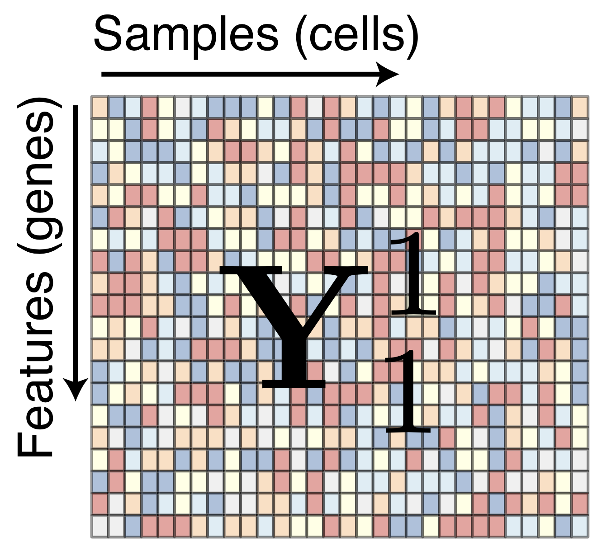
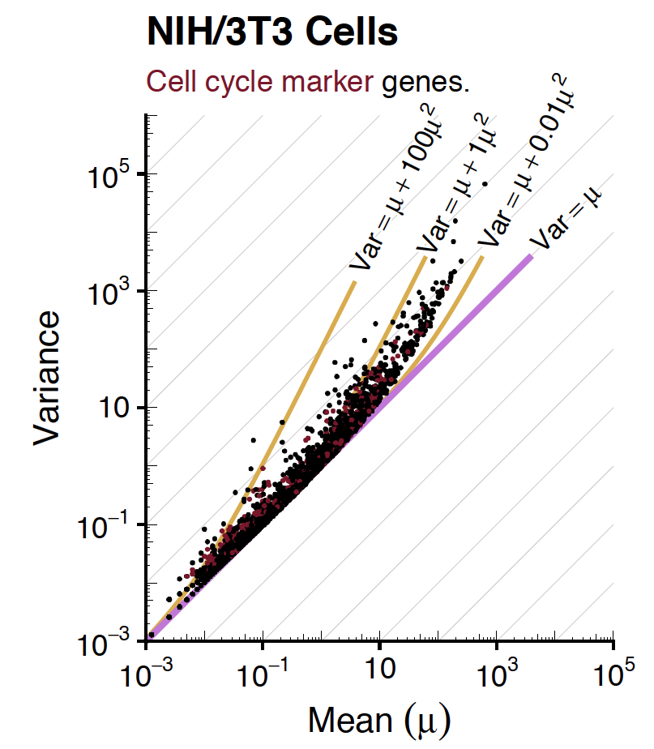
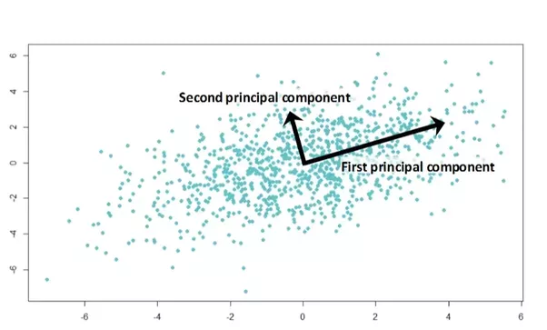

This tutorial roughly follows the Seurat pbms3k_tutorial:
<https://satijalab.org/seurat/v3.2/pbmc3k_tutorial.html> with some of my
own additions. For more Seurat tutorials see:
<https://satijalab.org/seurat/vignettes.html>

We will be using some [tidyverse](www.tidyverse.org) and data.table
packages. A nice blogpost outlining these is:
<https://wetlandscapes.com/blog/a-comparison-of-r-dialects/>

# Installs

This chunk of code will install the packages. You will only need to run
it once.

```{r, installs, results='hide'}
#install.packages("Seurat")
#install.packages("devtools")
#devtools::install_github('satijalab/seurat-data')
#InstallData("pbmc3k")
#install.packages("gridExtra")
#install.packages("data.table")
#install.packages("ggplot2")
#if (!requireNamespace("BiocManager", quietly = TRUE))
#    install.packages("BiocManager")
#BiocManager::install("SingleCellExperiment")
#BiocManager::install("glmGamPoi")
#BiocManager::install("scds")
#install.packages("useful")
```

# Imports

There are 3 main frameworks for scRNA-seq data analysis

In R:

-   Seurat

    -   Simple, but somewhat restrictive

    -   Does not always contain the best method

-   OSCA: A collection of bioconductor packages including scran,
    SingleCellExperiment, and batchelor

    -   A lot harder to get comfortable with

    -   More flexible

In python:

-   Scanpy

It is useful to switch between frameworks to use the "best" method.
Today we'll be mainly using Seurat, but switch to OSCA for doublet
detection

First, we want to import the packages we will be using.

```{r, imports, results='hide', message=FALSE}
library(Seurat)
library(SeuratData)
library(gridExtra)
library(tidyverse)
library(data.table)
library(SingleCellExperiment)
library(scds)
library(useful)
```

# Overview of a Typical scRNA-seq Pipeline

A typical scRNA-seq pipeline involves 4 preprocessing steps

1.  Quality Control

2.  Variance Stabilising Transformation

3.  Highly Variable Gene Selection

4.  Optional: Scaling

We will discuss these various steps today.

Further steps that we can do with the data are:

-   Clustering

-   Visualisation

-   Celltype Assignment. 2 Approaches:

    -   Marker Gene Selection

    -   Reference-based

-   Data integration/Batch Effect Correction

# Load data

We will be working with a toy dataset from 10X Genomics.

10X Genomics

-   Most widely used sequencing technology today, due to good
    throughput-coverage ratio

-   Up to 10,000 cells per library

-   \~3,500 genes per cell

-   \~20,000 UMIs per cell

    -   UMI - "unique molecular identifier"

    -   Each poly-adenylated RNA molecule is given a unique barcode
        (UMI)

    -   UMI control for PCR amplification bias

{width="174"}

{width="225"}

This dataset:

-   2,700 Cells

-   Species: Human

-   Sample: Peripheral Blood Mononucleated Cells (PBMCs)

-   Note: This is a toy dataset, down-sampled so everything runs quickly


**Note: getting the error: "no slot of name "images" for this object of
class "Seurat"" is totally normal. Don't worry if you get that.**

```{r, Data}
data("pbmc3k") # Or, alternatively:
# pbmc.data <- Read10X(data.dir = "filtered_gene_bc_matrices/hg19/")
# pbmc3k <- CreateSeuratObject(counts = pbmc.data, project = "pbmc3k", min.cells = 3, min.features = 200)
pbmc3k
```

As you can see, we have now loaded a dataset with 2700 samples (i.e.
cells) across 13714 features (i.e. genes). We have one "active assay",
meaning we have RNA data. We can access this assay and look at the count
matrix (the "head" function means that we are only displaying the first
6 rows):

```{r, ShowData}
corner(as.matrix(pbmc3k@assays$RNA@counts))
```

We also have a metadata file that gives us some information about each
cell (again, we're displaying the first 6 cells)

```{r, ShowMetaData}
head(pbmc3k@meta.data)
```

# 

# Quality Control the data

What do we need to check for?

-   Doublets: These cells have many UMIs, many genes

-   Stripped nuclei: These cells have few UMIs, few genes, low
    mitochondrial proportions

-   Low quality cells (e.g., due to inefficient reverse transcription or
    PCR amplification): These cells have few UMIs, few genes, high
    mitochondrial proportions

Why do we need to remove these cells? Artefacts could obscure true
underlying biology

Therefore 5 things we check when QCing a cell are:

-   The number of transcripts captured (automatically saved as
    nCount_RNA in the metadata table)

-   The number of unique genes captured (automatically saved as
    nFeature_RNA in the metadata table)

-   The percentage of the counts that come from mitochondrial genes (we
    will need to calculate this)

-   The percentage of the counts that come from ribosomal transcripts
    (we will need to calculate this), I think these are captured due to
    cryptic polyadenylation (but don't quote me on this)

-   Whether a cell is a doublet

## 1. Calculate mitochondrial and ribosomal percentage

```{r, percent_mt_ribo}
# calculate percent counts from mitochondrial genes
pbmc3k[["percent.mt"]] <- PercentageFeatureSet(pbmc3k, pattern = "MT-")


# calculate percent counts from mitochondrial genes:
ribo.genes <- c(grep(pattern = "^RPL", x = rownames(pbmc3k), value = TRUE),grep(pattern = "^RPS", x = rownames(pbmc3k), value = TRUE))
pbmc3k[["percent.ribo"]] <- PercentageFeatureSet(pbmc3k, features = ribo.genes)
```

Note that the pattern can depend on your core or your organism. E.g. if
you are given the genes as Ensembl IDs, you will first have to convert
them to symbols. Or, if you're working in mouse, the genes aren't all
caps, so you'll have to use "mt-" and "\^Rpl", "\^Rps".

## 2. Plot QC metrics (number of genes, number of UMIs, percent mito, percent ribo)

```{r, plot_QC_pre, fig.height=4, fig.width=16}
pbmc3k@meta.data$barcode <- rownames(pbmc3k@meta.data)
md <- pbmc3k@meta.data

p1 <- (ggplot(md, aes(x=nFeature_RNA)) +
  geom_density(fill="#e9ecef", position = 'identity') +
  labs(fill="") +
  theme_classic())

p2 <- (ggplot(md, aes(x=nCount_RNA)) +
  geom_density(fill="#e9ecef", position = 'identity') +
  labs(fill="") +
  scale_x_continuous(trans='log2') +
  theme_classic())

p3 <- (ggplot(md, aes(x=percent.mt)) +
  geom_density(fill="#e9ecef", position = 'identity') +
  labs(fill="") +
  scale_x_continuous(trans='log2') +
  theme_classic())

p4 <- (ggplot(md, aes(x=percent.ribo)) +
  geom_density(fill="#e9ecef", position = 'identity') +
  labs(fill="") +
  theme_classic())

grid.arrange(p1, p2, p3, p4, ncol=4)
```

## 3. Threshold the cells

Note that using a fixed threshold is the easiest method, but it isn't
necessarily the best. There are methods for "adaptive thresholds".

```{r, FirstQC, warning=FALSE}
min_nFeature_RNA <- 500
min_nCount_RNA <- 1250
min_percent.mt <- 0.5
max_percent.mt <- 5

md$barcode <- row.names(md)
md <- as.data.table(pbmc3k@meta.data)
md$pass_QC <- TRUE
md[nFeature_RNA < min_nFeature_RNA, pass_QC := FALSE]
md[nCount_RNA < min_nCount_RNA, pass_QC := FALSE]
md[percent.mt < min_percent.mt, pass_QC := FALSE]
md[percent.mt > max_percent.mt, pass_QC := FALSE]
```

## 4. Plot QC metrics for removed vs. retained cells

Let's plot the QC metrics splitting cells depending on whether they pass
QC:

```{r, plot_QC_post, fig.height=4, fig.width=24}
p1 <- (ggplot(md, aes(x=nFeature_RNA, fill=pass_QC)) +
  geom_density(alpha=0.4, position = 'identity') +
  labs(fill="") +
  geom_vline(xintercept=min_nFeature_RNA) +
  ggtitle(paste0("min=", min_nFeature_RNA)) +
  theme_classic())

p2 <- (ggplot(md, aes(x=nCount_RNA, fill=pass_QC)) +
  geom_density(alpha=0.4, position = 'identity') +
  labs(fill="") +
  geom_vline(xintercept=min_nCount_RNA) +
  ggtitle(paste0("min=", min_nCount_RNA)) +
  scale_x_continuous(trans='log2') +
  theme_classic())

p3 <- (ggplot(md, aes(x=percent.mt, fill=pass_QC)) +
  geom_density(alpha=0.4, position = 'identity') +
  labs(fill="") +
  geom_vline(xintercept=min_percent.mt) +
  geom_vline(xintercept=max_percent.mt) +
  ggtitle(paste0("min=", min_percent.mt, ", max=", max_percent.mt)) +
  scale_x_continuous(trans='log2') +
  theme_classic())

p4 <- (ggplot(md, aes(x=percent.ribo, fill=pass_QC)) +
  geom_density(alpha=0.4, position = 'identity') +
  labs(fill="") +
  theme_classic())

grid.arrange(p1, p2, p3, p4, ncol=4)
```

## 5. Doublet Detection

Theory:

-   Simply thresholding cells with many UMIs and genes isn't enough

-   Many methods exist for detecting doublets in silico, most take one
    of two approaches:

    -   Co-expression of genes that usually don't co-express

    -   Simulation of doublets by combining random cells

-   New technologies allow for identifying doublets in the data

-   Based on data from my group, many undetected doublets

-   *in silico* methods especially struggle with intra-cluster doublets

As far as I know, Seurat has no good inbuilt method for doing this. A
good comparison of methods is
[this](https://doi.org/10.1093/bioinformatics/btz698) paper. When
benchmarking methods myself, I found their hybrid method worked best.
Their method takes the data in a different format, so we need to convert
the data from Seurat to SingleCellExperiment

```{r, DoubletDetection}
pbmc3k <- subset(pbmc3k, subset = nFeature_RNA>min_nFeature_RNA & nCount_RNA>min_nCount_RNA & percent.mt>min_percent.mt & percent.mt<max_percent.mt)

pbmc3k_sce <- as.SingleCellExperiment(pbmc3k)
pbmc3k_sce <- cxds_bcds_hybrid(pbmc3k_sce, estNdbl=TRUE)
pbmc3k <- AddMetaData(
  object = pbmc3k,
  metadata = pbmc3k_sce$hybrid_call,
  col.name = "doublet"
)

pbmc3k <- subset(pbmc3k, subset = doublet==FALSE)
```

### a side note

On my own data, I don't find this to be enough. When I was able to have
more of a ground truth doublet calling (using cell hashing and
genotyping) I found that this only got me to a TPR of 41% (on
differentating cell line data), and 50% (on differentiating mESC data).
Therefore, I remove any cells that are similar to called doublets, and
thereby was able to get my TPR to 82% and 79%, respectively. This step
completely overkills on this toy dataset, but I'll include my code here,
in case you want to try it in the future:

```{r, further_doublet_calling, eval=FALSE}
pbmc3k <- NormalizeData(pbmc3k)
pbmc3k <- FindVariableFeatures(pbmc3k)
pbmc3k <- ScaleData(pbmc3k)
pbmc3k <- RunPCA(pbmc3k, verbose=FALSE)
pbmc3k <- FindNeighbors(pbmc3k, k.param=10, reduction = "pca")

md <- pbmc3k@meta.data

tmp <- data.table(hybrid_map = rowSums(pbmc3k@graphs$RNA_nn[,md[hybrid_call==TRUE]$cell])/10,
                  barcode = rownames(pbmc3k@graphs$RNA_snn))
md <- merge(md, tmp, by = "barcode", all.x=TRUE)
md[hybrid_call==TRUE, hybrid_map := NA]
md[,hybrid_call2 := TRUE]
md[hybrid_map<=((sum(md$hybrid_call==TRUE))/(dim(md)[1])), hybrid_call2 := FALSE]
rownames(md) <- md$cell
```

## Discussion

-   How to choose thresholds?

-   How do we know that we're not removing biologically meaningful
    cells? (e.g. a very transcriptionally inactive population)

# Variance Stabilising Transformation

-   Single cell data has a mean-variance relationship, as shown below:
    Genes with high means, vary a lot regardless of whether they are
    biologically meaningful in your system

```{r, Mean_Variance_Relationship, fig.height=4, fig.width=4}
means <- sparseMatrixStats::rowMeans2(pbmc3k@assays$RNA@counts)
variance <- sparseMatrixStats::rowVars(pbmc3k@assays$RNA@counts)
plot(means, variance)
```



-   The mean-variance relation matches a Gamma-Poisson distribution

-   The statistically most robust approach to handle such data are
    generalized linear models (GLMs), for example implemented by
    `DESeq2`, `edgeR`, or `glmGamPoi`. However they can be difficult to
    fit and exclude the application of many general purpose methods for
    clustering, dimension reduction and classification

-   The alternative is to try to *normalize* the data. This mainly
    implies that the mean and variance become independent
    (homo-skedastic). That is why this step is also called **variance
    stabilizing transformation** (VST).

-   The most basic method is log normalisation:

    -   Kind of stabilises the variance

    -   but not really...

```{r, LogNormalisation, fig.height=4, fig.width=4}
pbmc3k <- NormalizeData(pbmc3k, normalization.method = "LogNormalize")

means <- sparseMatrixStats::rowMeans2(as.matrix(pbmc3k@assays$RNA@data))
variance <- sparseMatrixStats::rowVars(pbmc3k@assays$RNA@data)
plot(means, variance)
```

-   Alternative VSTs are based on the delta-method

-   Two popular alternatives

    -   Ascombe's transformation: $2 \sqrt{x}$

    -   DESeq2's transformation:
        $\frac{1}{\sqrt{\alpha}} \text{asinh}(\sqrt\alpha x)$

-   Not actually much more successful because all struggle to stabilize
    small counts (and always will see Warton (2018))

```{r}
# Fix it to kind of reasonable value
alpha <- 0.1
stab_data <- 1 / sqrt(alpha) * asinh(sqrt(alpha) * pbmc3k@assays$RNA@data)

means <- sparseMatrixStats::rowMeans2(stab_data)
variance <- sparseMatrixStats::rowVars(stab_data)
plot(means, variance)
```

-   Third apporach: `sctransform`

    -   Based on pearson residuals

    -   Trade's off stabilization at small means for potentially reduced
        sensitivity for real biological differences

    -   Worked quite well in a recent benchmark (Germain et al. 2020)

```{r, Normalisation, fig.height=4, fig.width=4}
pbmc3k <- SCTransform(pbmc3k, method="glmGamPoi",verbose=FALSE)

means <- sparseMatrixStats::rowMeans2(pbmc3k@assays$SCT@data)
variance <- sparseMatrixStats::rowVars(pbmc3k@assays$SCT@data)
plot(means, variance)
```

-   Scaling

```{r}
hist(sparseMatrixStats::colSums2(pbmc3k@assays$SCT@data), main = "Counts per Cell")
```

    -   Goal: remove library size-dependent differences in variance

    -   Seurat also scales each cell's counts by a scale factor before
        normalisation

    -   scran uses more sophisticated methods of estimating scale factor

    -   sctransform treats them a bit weirdly, but you can just suppose that they are handled as size factors

-   For somebody else's take on the topic see:
    <https://ltla.github.io/SingleCellThoughts/general/transformation.html>

## Discussion

-   Where does the VST work well?

-   Which genes does the VST work poorly for?

-   When may we want to use count data instead?

-   Are the data still sparse? What's the benefit of sparse data?

# Highly Variable Gene Selection

-   \~30,000 protein-coding genes in mice and men

-   Most genes don't vary systematically between cells

-   Variance in most genes is technical noise --\> introduces noise but
    we don't gain any information

```{r, HVG_Selec, fig.height=4, fig.width=4}
pbmc3k <- FindVariableFeatures(pbmc3k)

to.plot <- data.table(means=rowMeans(pbmc3k@assays$SCT@data),
                      variance=rowVars(as.matrix(pbmc3k@assays$SCT@data)),
                      hvg=(rownames(pbmc3k@assays$SCT@data) %in% VariableFeatures(pbmc3k)))

p <- ggplot(data=to.plot, mapping = aes(x=means, y=variance, colour=hvg)) +
  geom_point(size=0.5, alpha=1) +
  guides(colour = guide_legend(override.aes = list(size=1))) +
  theme_classic()
print(p)
```

## Discussion

-   How do you choose HVGs?

-   How many HVGs should we use?

# Scaling the Data

-   Standardisation: All features (genes) have mean of 0 and unit
    variance

-   Pro: Ensures that high-variance genes don't dominate

-   Cons:

    -   No weighting in how highly variable a gene is, and amplifies
        more minor variance

    -   Blurs boundaries between subpopulations (especially when the
        gene has \>2 states)

    -   Removes log-fold changes

    -   Biases towards number of differentially expressed genes (vs.
        amplitude of difference in expression)

-   Personally, I think the cons outweigh the pros, but Seurat forces us
    to use it. To avoid it, Donnacha has a hack.

-   Further discussion:
    <https://ltla.github.io/SingleCellThoughts/general/standardization.html>

```{r, ScaleData, fig.height=4, fig.width=4}
pbmc3k <- ScaleData(pbmc3k)
#pbmc3k@assays$SCT@scale.data <- pbmc3k@assays$SCT@data@x

means <- rowMeans(pbmc3k@assays$SCT@scale.data)
variance <- rowVars(pbmc3k@assays$SCT@scale.data)
p1 <- plot(means, variance)
print(p1)

p2 <- hist(means)
print(p2)

p2 <- hist(variance)
print(p2)
```

# Clustering

## A Side-Note on PCA

-   We do a lot of calculations in "PCA" space

-   Instead of working with each gene individually, they are combined
    into principle components (PCs)

-   PCs are ordered by how much variance they explain. We only use the
    top 10-50 PCs --\> removes noise

{width="267"}

{width="327"}

{width="264"}

## Back to Clustering

Why?

-   Sparsity of each individual cell -\> More power in group

-   We want to investigate cell types

How?

-   Reduce dimensionality using PCA first

-   Graph based

-   Popularised by Seurat

-   Several algorithms

-   Build graph using knn or snn


```{r, Clustering, fig.height=4, fig.width=4}
pbmc3k <- RunPCA(pbmc3k, verbose=FALSE)
pbmc3k <- FindNeighbors(pbmc3k, k.param=10, reduction = "pca")
pbmc3k <- FindClusters(pbmc3k, resolution = 0.5)
p <- ggplot(data=as.data.table(pbmc3k@meta.data)[,.N,by="seurat_clusters"], mapping = aes(x=seurat_clusters, y=N, fill=seurat_clusters)) +
  geom_bar(stat="identity") +
  labs(x="Cluster Number", y="Number of Cells in that Cluster") +
  theme_classic()
print(p)
```

# Visualisation

We like seeing our data, but scRNA-seq data is high dimensional and
humans struggle beyond 2. Therefore, we want to reduce our data to 2
dimensions:

-   Could use PCA

-   Could use t-SNE: Maintains local distances

-   Could use UMAP: Fits a manifold

-   State of the art: PCA followed by UMAP

```{r, Visualisation1, fig.height=4, fig.width=4}
pbmc3k <- RunUMAP(pbmc3k, dims = 1:10)
DimPlot(pbmc3k, reduction = "umap", pt.size = 0.1, shuffle = TRUE) + coord_fixed()
```

## Discussion

-   How much information can we get from the UMAP? And when should we be
    careful?

-   How can we evaluate if the UMAP is doing a good job?

Fun with UMAPs: UMAP zoo:
<https://duhaime.s3.amazonaws.com/apps/umap-zoo/index.html>

# Celltype Annotation

## Method 1: Using Marker Genes

```{r, MarkerGenes}
cluster1.markers <- FindMarkers(pbmc3k, ident.1 = 1, min.pct = 0.25)
head(cluster1.markers, n = 5)
```

Luckily, in this dataset we know the cell types very well and have known
marker genes. From [the
vignette](https://satijalab.org/seurat/v3.2/pbmc3k_tutorial.html):

| Markers               | Cell Type    |
|-----------------------|--------------|
| IL7R, CCR7            | Naive CD4+ T |
| IL7R, S100A4          | Memory CD4+  |
| CD14, LYZ             | CD14+ Mono   |
| MS4A1                 | B            |
| CD8A                  | CD8+ T       |
| FCGR3A, MS4A7 FCGR3A+ | Mono         |
| GNLY, NKG7            | NK           |
| FCER1A, CST3          | DC           |
| PPBP                  | Platelet     |

Based on this, Seurat has already annotated the cells. Let's visualise.
Do they agree with our clusters? Why not?

```{r, Visualisation2, fig.height=4, fig.width=6}
DimPlot(pbmc3k, reduction = "umap", pt.size = 0.1, shuffle = TRUE) + coord_fixed()
DimPlot(pbmc3k, reduction = "umap", group.by = "seurat_annotations", pt.size = 0.1, shuffle = TRUE) + coord_fixed()
```

### Differential Expression Testing

Clusters are just groups of cells which have roughly similar gene
expression profiles to each other. Clusters can represent:

-   Cell type, or subtype (we often want this)

-   Cell cycle phase

-   Doublets (remove)

-   Stripped nuclei/dead cells (remove)

-   Batch/sample (can "correct")

-   A combination of the above

To interpret the meaning of these clusters, we must put our detective
hats on and find out what genes/gene patterns define them. There are
several metrics for which genes best characterize each cluster. Here, we
discuss two different approaches:

A: Difference in average expression

A popular approach is to compare differences in average expression for
each gene in one cluster vs all other clusters. The significance of
these differences can be assessed, for example, with the Wilcoxon Rank
Sum test. However, the large number of cells often leads to exaggerated
p-values and fold-change is heavily influenced by outliers, or genes
which may only characterize a small portion of a cluster.

```{r}
# Wilcox test for differentially expressed genes. May take 20-30s.
FCmarkers <- FindAllMarkers(pbmc3k, logfc.threshold = 0.25, test.use = "wilcox", min.pct = 0.25)
FCmarkers %>% group_by(cluster) %>% top_n(n = 10, wt = -p_val_adj)
```

Note that both positively and negatively differentially expressed genes
are identified. avg_log2FC shows the fold-change in mean expression,
whereas p_val_adj indicates the significance.

```{r}
# Marker heatmap
topFCmarkers <- FCmarkers %>% group_by(cluster) %>% top_n(n = 3, wt = -p_val_adj)
DoHeatmap(pbmc3k, features = topFCmarkers$gene, slot = 'scale.data', disp.max = 3)
```

```{r}
# Log fold change of main cluster markers
ggplot(topFCmarkers, aes(x = gene, y = avg_log2FC, fill = gene)) +
  geom_col() +
  theme_bw() +
    facet_grid(. ~ cluster, scales = "free") +
  RotatedAxis() +
  NoLegend() +
  theme(text = element_text(size=8))
```

B: ROC analysis

Aside from testing differences in average expression, which is prone to
identifying markers which may not represent the cluster's full
population, another approach to identifying cluster markers is to ask
which genes can be used to best classify cells in each cluster from all
remaining cells. For this, we borrow a simple measurement from
supervised learning: the area under the ROC curve (TPR vs FPR).

```{r}
# Test area under the ROC curve for markers for each cluster. May take 20-30s.
ROCmarkers <- FindAllMarkers(pbmc3k, logfc.threshold = 0.25, test.use = "roc", min.pct = 0.25)
ROCmarkers %>% group_by(cluster) %>% top_n(n = 10, wt = myAUC)
```

An AUC of 1 represents a perfect positive classifier (positive only on
all cells in the cluster), while an AUC of 0 represents a perfect
negative classifier (negative/absent only on all cells in the cluster).
An AUC of 0.5 means the gene has no classification power.

```{r}
# Marker heatmap
topROCmarkers <- ROCmarkers %>% group_by(cluster) %>% top_n(n = 3, wt = myAUC)
DoHeatmap(pbmc3k, features = topROCmarkers$gene, slot = 'scale.data', disp.max = 3)
```

Note minor differences in the markers identified by ROC vs Wilcox

```{r}
# Area under the ROC curve of main cluster markers
ggplot(topROCmarkers, aes(x = gene, y = myAUC, fill = gene)) +
  geom_col() +
  theme_bw() +
    facet_grid(. ~ cluster, scales = "free") +
  RotatedAxis() +
  NoLegend() +
  theme(text = element_text(size=8))
```

Note that for each cluster, there are moderate-to-strong positive
classifiers. See if you can use these to guess the identity of each
cluster (no, not Colonel Mustard...)

Which method you use to identify cluster markers also depends on your
goals...

### Exploring Known Celltype Markers

Since we already know the major PBMC cell types and their markers, we
can directly use these to characterize our clusters.

| Markers               | Cell Type    |
|-----------------------|--------------|
| IL7R, CCR7            | Naive CD4+ T |
| IL7R, S100A4          | Memory CD4+  |
| CD14, LYZ             | CD14+ Mono   |
| MS4A1                 | B            |
| CD8A                  | CD8+ T       |
| FCGR3A, MS4A7 FCGR3A+ | Mono         |
| GNLY, NKG7            | NK           |
| FCER1A, CST3          | DC           |
| PPBP                  | Platelet     |

```{r}
markers.to.plot <- c("IL7R", "CCR7", "S100A4", "CD14", "LYZ", "MS4A1", "CD8A", "FCGR3A", "MS4A7", "GNLY", "NKG7", "FCER1A", "CST3", "PPBP")
DotPlot(pbmc3k, features = markers.to.plot, cols = c("blue", "red"), dot.scale = 10, cluster.idents = T) + RotatedAxis()
```

Now try assigning the clusters to cell types...

## Method 2: Using a Reference Atlas

Another method is to use previously annotated, similar datasets. Such
high-quality, annotated datasets are known as "atlases". Big projects,
perhaps most notably the [human cell
atlas](https://www.humancellatlas.org/), exist to create such atlases
that can be used to annotate and compare future datasets. Usually, these
atlases are healthy/unperturbed/*in vivo* samples, which you can map
your diseased/perturbed/(in my case) organoid samples to.

Assigning celltypes using a reference atlas, requires you to integrate
your data with the reference atlas. There are many ways to do this, and
I recommend [Luecken *et al.*,
2020](https://www.biorxiv.org/content/10.1101/2020.05.22.111161v2) for a
good overview and analysis. Different methods can give drastically
different results, and even how you preprocess the data can affect
results.

In short:

-   Batch effects are technical variance in gene expression that exist
    between samples. These can be large or small:

    -   Small: e.g. replicates processed by the same researcher on
        different days

    -   Large: e.g. samples processed with different technologies in
        different species in different labs

    -   ==\> Depending on how similar your data are to the atlas, your
        batch effects could vary in size

-   Data integration methods attempt to estimate the batch effect for
    each cell, and apply a correction vector to each

    -   However, it's very hard to disentangle technical and biological
        variance in high dimensions

    -   Some methods assume more, others less technical variance

    -   Advice: Be critical: Some methods may not remove batch effects
        sufficiently, while others may remove too much

-   Miscellaneous advice:

    -   These methods always give you a celltype annotation! It's very
        hard to say if it's a good annotation or not. Look at marker
        genes to check (but this is a very hard question).

    -   Just because your two samples don't overlap well on a UMAP after
        integration, doesn't mean that they mapped poorly (though it's
        certainly something to be on the lookout for)

    -   Integrate the atlas first, and then map your samples to the
        atlas

    -   When integrating the atlas, integrate within a timepoint, and
        then across timepoints

    -   Integrate each of your samples with the atlas separately

{width="272"}


# Batch effect correction

Similar to reference mapping, if you are analysing separate samples, you
may have batch effects between samples.

Do you have batch effects?

-   Were your samples generated from the same pool of cells on the same
    day, just in separate 10X lanes? Then you probably don't have to
    batch effect correct (though some people still do)

-   Otherwise: YES!

Apart from this, the same methods as above are used, and thus the same
advice still applies:

-   Try several methods

-   Check if meaningful biological variance is being removed
    ("over-integration")
